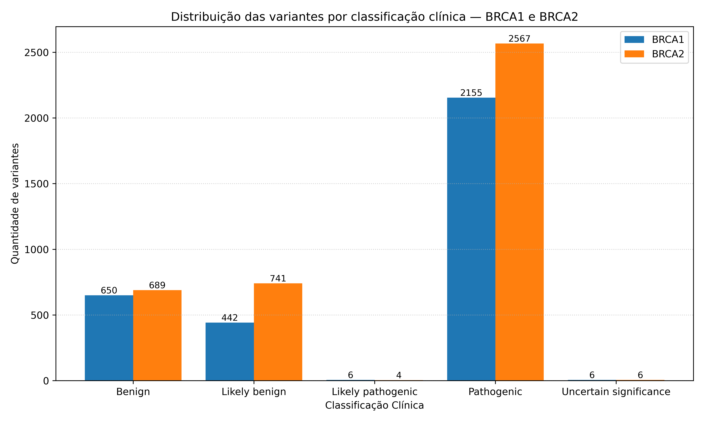
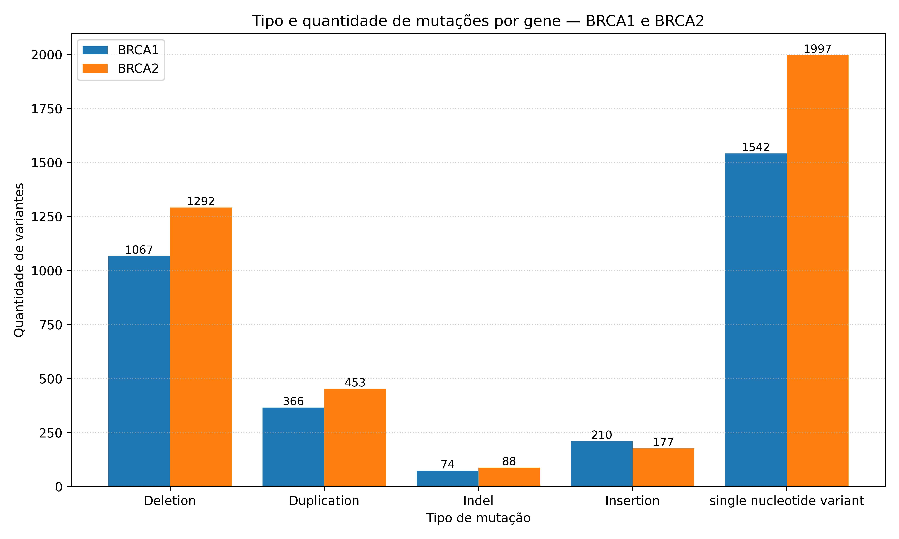

# Resumo do Projeto

Este projeto propõe a aplicação de técnicas de Inteligência Artificial (IA) à análise de variantes nos genes BRCA1/BRCA2 no contexto do câncer de mama. Serão desenvolvidos dois modelos de Inteligência Artificial (IA): (i) um classificador de variantes (patogênicas, benignas ou de significado incerto) e (ii) um modelo probabilístico capaz de estimar o potencial patogênico de cada variante. 
 
A base de dados será consolidada a partir do ClinVar e dbSNP, normalizada para o genoma de referência GRCh38 e enriquecida com anotações obtidas via APIs do Ensembl, bem como com informações estruturais do UniProt e recursos do projeto AlphaFold, quando pertinente. 
 
As representações das variantes combinarão atributos tabulares (coordenadas, tipo e consequência, metadados de curadoria) com informações derivadas de sequência (janelas de DNA/proteína). O segundo modelo dará ênfase ao impacto funcional, considerando posição e transcrito afetados, tipo de evento (missense, nonsense, frameshift, alterações de splicing) e efeito esperado na proteína. Alterações truncantes e mutações associadas à perda de função tendem a aumentar a probabilidade prevista. 
 
O desempenho dos modelos será avaliado com métricas apropriadas, incluindo a calibração probabilística, de forma a possibilitar a priorização interpretável de variantes e oferecer um fluxo reprodutível de análise, útil à pesquisa translacional em oncologia de precisão.

## Amostragem dos dados

| VariationID | GeneSymbol | ClinicalSignificance | ClinSigSimple | Type                       | Origin           | Assembly | Chromosome |   Start   |   Stop    |
|-------------|------------|----------------------|---------------|----------------------------|-----------------|----------|------------|-----------|-----------|
| 209219      | BRCA1      | Benign               | 0             | single nucleotide variant  | germline        | GRCh38   | 17         | 43039471  | 43039471  |
| 55602       | BRCA1      | Pathogenic           | 1             | Deletion                   | germline        | GRCh38   | 17         | 43045706  | 43045767  |
| 209597      | BRCA2      | Benign               | 0             | single nucleotide variant  | germline        | GRCh38   | 13         | 32314943  | 32314943  |
| 51579       | BRCA2      | Pathogenic           | 1             | single nucleotide variant  | germline;unknown| GRCh38   | 13         | 32316463  | 32316463  |

---

## Distribuição das variantes por classificação clínica — BRCA1 e BRCA2

---

## Tipo e quantidade de mutações por gene - BRCA1 e BRCA2

---

# Perguntas para Especialistas

## Pergunta 1

Quando o ClinVar ou o Ensembl fornece uma anotação em HGVS, é possível assumir que os alelos listados (ref/alt) já estão alinhados à sequência oficial (GRCh38)? De forma mais ampla, quais são as melhores práticas para garantir o uso da sequência correta (wild-type) dos genes BRCA1/BRCA2, considerando discrepâncias entre diferentes fontes (ex.: L78833.1 vs. GRCh38)? Além disso, quais métodos são recomendados para validar ou migrar coordenadas entre diferentes versões do genoma humano (ex.: GRCh37 → GRCh38)?

---

## Pergunta 2
Quais são as recomendações atuais para padronizar a representação de variantes genéticas em relatórios clínicos e bases computacionais, especialmente em casos de mutações complexas, como indels ou rearranjos estruturais maiores? Existem convenções internacionais consolidadas (ex.: HGVS, VCF, clinical guidelines) consideradas referência obrigatória em contextos médicos e de pesquisa?

---

## Pergunta 3
Em quais cenários variantes do tipo missense ou grandes rearranjos genômicos (LGRs) exigem estudos funcionais ou estruturais complementares? Quais são os critérios clínicos mínimos da literatura, atualmente, aceitos para classificá-las como patogênicas?

---

## Pergunta 4
Na prática clínica, quais são os erros mais graves e recorrentes na interpretação de variantes em BRCA1/BRCA2 que devem ser evitados ao conduzir pesquisas e análises computacionais?

---

## Pergunta 5
Do ponto de vista clínico, ético e legal, quais são as principais limitações e responsabilidades ao propor um modelo de **Inteligência Artificial** que classifica variantes genéticas (patogênicas, benignas, VUS, etc.) e prediz probabilidades de risco?  
Além da **LGPD**, existe alguma legislação, regulamentação ou normativa específica que trate do uso de dados genômicos e sensíveis em pesquisas médicas no Brasil?

## Anotações:

- Uniprot (BRCA1 - Human) : https://www.uniprot.org/uniprotkb?query=%28gene%3ABRCA1%29&facets=model_organism%3A9606
- Proteina P38398-5 para o id(ENST00000352993) -> https://www.uniprot.org/uniprotkb/P38398/genomic-coordinates
- Arquivo Patient.fasta é um arquivo alterado na mão para teste de detecção de variantes

# 📖 Explicação das métricas

- **AUROC (Area Under ROC Curve)**  
  Mede a capacidade do modelo de separar classes em todos os thresholds.  
  - 1.0 = separação perfeita  
  - 0.5 = aleatório  

- **AUPRC (Area Under Precision-Recall Curve)**  
  Mostra o equilíbrio entre *precisão* e *recall*, importante em dados desbalanceados.  
  - 1.0 = perfeito  
  - Quanto mais próximo de 0.5, mais fraco  

- **Recall (Sensibilidade)**  
  Dos positivos verdadeiros, quantos o modelo consegue encontrar.  
  - Alta recall = quase nenhum positivo real fica de fora  

- **Precision (Precisão Positiva)**  
  Dos exemplos previstos como positivos, quantos são realmente positivos.  
  - Alta precision = poucos falsos positivos  

- **F1-score**  
  Média harmônica entre *precision* e *recall*.  
  - Bom para medir equilíbrio entre os dois  

- **Balanced Accuracy**  
  Média da acurácia por classe (corrige para desbalanceamento).  

- **MCC (Matthews Correlation Coefficient)**  
  Correlação entre verdade e predição.  
  - -1 = tudo errado  
  - 0 = aleatório  
  - +1 = perfeito  

- **Accuracy (Acurácia Simples)**  
  Proporção de acertos totais. Pode ser enganosa em classes desbalanceadas.  

- **mean / std**  
  - `mean`: média dos folds da validação cruzada  
  - `std`: desvio padrão → quanto maior, mais instável o modelo  

---

# 📊 Resultados iniciais por gene

## 🔬 BRCA1
- **AUROC**: 0.993 ± 0.0027 → separação quase perfeita  
- **AUPRC**: 0.996 ± 0.0013 → altíssima precisão-recall  
- **Recall**: 0.979 ± 0.0075 → quase todos os positivos encontrados  
- **Precision**: 0.983 ± 0.0079 → quase sem falsos positivos  
- **F1-score**: 0.981 ± 0.0051 → equilíbrio excelente  
- **Balanced Accuracy**: 0.973 ± 0.0083  
- **MCC**: 0.945 ± 0.0150 → correlação forte, quase perfeito  
- **Accuracy**: 0.975 ± 0.0067  

👉 **Resumo**: Modelo extremamente bom e consistente para BRCA1.

---

## 🔬 BRCA2
- **AUROC**: 0.548 ± 0.295 → desempenho instável, próximo de aleatório em alguns folds  
- **AUPRC**: 0.701 ± 0.205 → aceitável, mas longe do ideal  
- **Recall**: 0.969 ± 0.068 → quase todos os positivos encontrados  
- **Precision**: 0.733 ± 0.121 → número relevante de falsos positivos  
- **F1-score**: 0.825 ± 0.054 → equilíbrio aceitável, mas abaixo do BRCA1  
- **Balanced Accuracy**: 0.630 ± 0.153 → dificuldades em tratar classes de forma equilibrada  
- **MCC**: 0.327 ± 0.294 → baixa correlação, instável  
- **Accuracy**: 0.727 ± 0.099  

👉 **Resumo**: Modelo para BRCA2 tem recall alto (quase não perde positivos),  
mas sofre com baixa precisão e instabilidade entre folds.

## 🧩 Matrizes de confusão (CV — somadas em todos os folds)

> Linhas = **Verdadeiro** (rótulo real) • Colunas = **Predito** (saída do modelo)  
> **TN** = True Negative • **FP** = False Positive • **FN** = False Negative • **TP** = True Positive

### BRCA1
|                  | **Pred: Benigno** | **Pred: Patogênico** |
|------------------|-------------------|-----------------------|
| **Verdadeiro Benigno**     | **TN = 947**         | **FP = 145**           |
| **Verdadeiro Patogênico**  | **FN = 16**          | **TP = 2148**          |

- Matriz (forma 2×2): `[[947, 145], [16, 2148]]`  
- Totais: reais benignos = 947 + 145 = **1092** • reais patogênicos = 16 + 2148 = **2164** • total = **3256**

### BRCA2
|                  | **Pred: Benigno** | **Pred: Patogênico** |
|------------------|-------------------|-----------------------|
| **Verdadeiro Benigno**     | **TN = 1385**        | **FP = 45**            |
| **Verdadeiro Patogênico**  | **FN = 19**          | **TP = 2556**          |

- Matriz (forma 2×2): `[[1385, 45], [19, 2556]]`  
- Totais: reais benignos = 1385 + 45 = **1430** • reais patogênicos = 19 + 2556 = **2575** • total = **4005**

# Como calculamos a “Confiança” do modelo

A “confiança” que exibimos vem da **entropia** da distribuição de probabilidades prevista para as classes, **normalizada** para ficar entre 0 e 1, e então invertida:

\[
\textbf{Confiança} \;=\; 1 \;-\; \underbrace{\frac{H(p)}{\log K}}_{\text{entropia normalizada}}
\]

- \(p\) é o vetor de probabilidades previsto pelo modelo para as \(K\) classes (no nosso caso, \(K=4\)):
  \[
  p = [P(y{=}0),\;P(y{=}1),\;P(y{=}2),\;P(y{=}3)]
  \]
  com \(p_k \ge 0\) e \(\sum_k p_k = 1\).
- \(H(p)\) é a **entropia de Shannon** (com log natural, “ln”):
  \[
  \boxed{H(p) \;=\; -\sum_{k=0}^{K-1} p_k \,\ln p_k}
  \]
- \(\log K\) é o valor **máximo** que a entropia pode atingir quando a distribuição é **uniforme** \((p_k = 1/K)\). Dividir por \(\log K\) normaliza o valor para \([0,1]\).

> Interpretação rápida  
> - **Entropia baixa** → distribuição concentrada em uma classe → **alta confiança**.  
> - **Entropia alta** → distribuição espalhada entre classes → **baixa confiança**.

---

## Passo a passo (com \(K=4\))

1. **Probabilidades por classe**  
   Suponha que o modelo preveja:
   \[
   p = [p_0,\; p_1,\; p_2,\; p_3] \quad\text{com}\quad p_0+p_1+p_2+p_3=1
   \]

2. **Entropia (em “nats”, usando ln)**  
   \[
   H(p) = -\big(p_0 \ln p_0 + p_1 \ln p_1 + p_2 \ln p_2 + p_3 \ln p_3\big)
   \]
   > Dica: se algum \(p_k=0\), usamos um **epsilon** muito pequeno (ex.: \(10^{-12}\)) só para evitar \(\ln(0)\).

3. **Normalização**  
   \[
   H_{\text{norm}}(p) = \frac{H(p)}{\ln 4}
   \]
   - Por que \(\ln 4\)? Porque \(\ln K\) é a **entropia máxima** quando \(p = [\tfrac{1}{K},\ldots,\tfrac{1}{K}]\).  
   - Assim, \(H_{\text{norm}}\in[0,1]\): 0 = certeza total; 1 = totalmente uniforme.

4. **Confiança**  
   \[
   \text{Confiança} = 1 - H_{\text{norm}}(p)
   \]
   - Resultado também em \([0,1]\). Quanto **maior** o valor, **mais confiante** o modelo.

---

## Passo a passo (com \(K=4\))

1. **Probabilidades por classe**  
   Suponha:
   \[
   p = [0.12,\; 0.02,\; 0.03,\; 0.83]
   \]

2. **Entropia (nats, usando \(\ln\))**  
   \[
   H(p) = -\big(0.12\ln0.12 + 0.02\ln0.02 + 0.03\ln0.03 + 0.83\ln0.83\big)
   \]
   \[
   H(p) \;\approx\; \mathbf{0.5925}
   \]

3. **Normalização**  
   \[
   \log 4 \;\approx\; 1.3863
   \qquad\Rightarrow\qquad
   H_{\text{norm}}(p) \;=\; \frac{H(p)}{\log 4} \;\approx\; \frac{0.5925}{1.3863} \;\approx\; \mathbf{0.4274}
   \]

4. **Confiança**  
   \[
   \text{Confiança} \;=\; 1 - H_{\text{norm}}(p) \;\approx\; 1 - 0.4274 \;\approx\; \mathbf{0.5726}
   \]

> Observação prática: mesmo com a maior probabilidade em uma classe, a presença de massa não desprezível nas demais aumenta a entropia e reduz a confiança. É exatamente isso que a entropia captura.