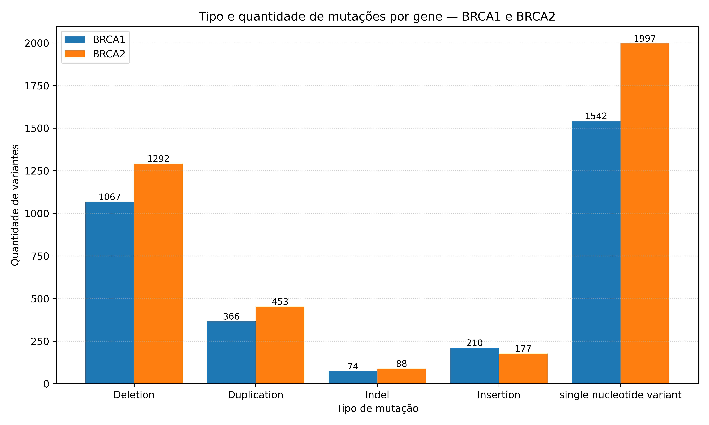

# Resumo do Projeto

Este projeto aplica técnicas de Inteligência Artificial à análise de variantes nos genes BRCA1/BRCA2 no contexto do câncer de mama. Serão desenvolvidos dois modelos de Inteligência Artificial (IA): (i) um classificador supervisionado para rotular variantes (patogênica, benigna ou de significado incerto) e (ii) um modelo probabilístico que estima o potencial patogênico de cada variante. A base de dados será consolidada a partir de ClinVar e dbSNP, normalizada para GRCh38 e enriquecida por anotações obtidas via APIs do Ensembl e por informações estruturais do UniProt, com uso de recursos como AlphaFold quando pertinente. As representações combinam atributos tabulares (coordenadas, tipo e consequência, metadados de curadoria) e informações derivadas de sequência (janelas de DNA/proteína). O segundo modelo enfatiza o impacto funcional considerando posição e transcrito afetados, tipo de evento (missense, nonsense, frameshift, alterações de splicing) e efeito esperado na proteína; eventos truncantes e alterações com perda de função tendem a elevar a probabilidade prevista. O desempenho será avaliado com métricas apropriadas e calibração de probabilidades, visando priorização interpretável de variantes e um fluxo reprodutível útil à pesquisa translacional em oncologia de precisão.

## Tipo e quantidade de mutações por gene - BRCA1 e BRCA2

